# 1. Project Overview

This project implements an end-to-end MLOps pipeline for predicting heart
disease risk from patient clinical data, using the UCI Heart Disease dataset
(Cleveland subset, 303 patients, 13 clinical features). The scope covers data
acquisition and cleaning, model training with experiment tracking, automated
testing and CI/CD, containerization, Kubernetes deployment, and monitoring.

**Repository:** https://github.com/Rashampreet4114/heart-disease-mlops

Three models were trained and compared (Logistic Regression, Random Forest,
and XGBoost). The target variable was
reframed from the raw multi-class severity scale (0–4) to a binary
disease/no-disease label, consistent with the assignment's risk-prediction
framing. Monitoring uses a lightweight custom logging and metrics dashboard
rather than a full Prometheus/Grafana stack, scaled to match its weight in
the grading rubric.

## 1.1 Architecture

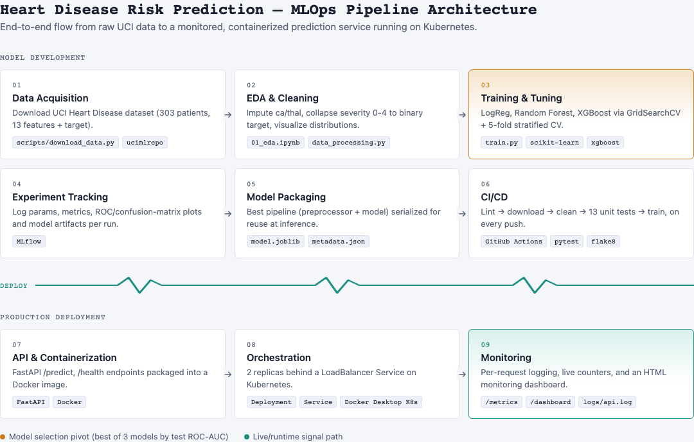

The pipeline is organized into two stages. The model development stage —
data acquisition through CI/CD — runs on every code push. The production
deployment stage — API, container, orchestration, monitoring — serves the
trained model.

# 2. Setup / Install Instructions

```bash
# 1. Clone and enter the repo
git clone https://github.com/Rashampreet4114/heart-disease-mlops.git
cd heart-disease-mlops

# 2. Create an isolated virtual environment
python3 -m venv venv
source venv/bin/activate
pip install -r requirements.txt

# 3. Run the pipeline
python scripts/download_data.py       # download raw dataset -> data/raw/
python -m src.data_processing         # clean + binarize target -> data/processed/
python -m src.train                   # train, tune, MLflow-track, save best model
flake8 src/ api/ tests/ scripts/      # lint
pytest tests/ -v                      # 13 unit tests

# 4. Run the API
uvicorn api.main:app --host 0.0.0.0 --port 8000
# Swagger UI: http://localhost:8000/docs

# 5. Docker
docker build -t heart-disease-api:latest .
docker run -d -p 8000:8000 heart-disease-api:latest

# 6. Kubernetes (Docker Desktop Kubernetes or Minikube)
kubectl apply -f k8s/deployment.yaml -f k8s/service.yaml
kubectl port-forward svc/heart-disease-api-service 8080:80
```

Additional setup detail, including the access-instruction caveat for the
local Kubernetes LoadBalancer, is documented in the repository's `README.md`.

# 3. Data Acquisition & EDA

The dataset is retrieved programmatically via `ucimlrepo`
(`scripts/download_data.py`) rather than committing a manually downloaded
file, keeping the repository reproducible from a clean clone. It contains
303 patient records with 13 features — age, sex, chest pain type, resting
blood pressure, cholesterol, fasting blood sugar, resting ECG, max heart
rate, exercise angina, ST depression, slope, number of major vessels, and
thalassemia — plus a target column.

**Cleaning:** the raw `num` column is a 0–4 severity scale. It was collapsed
into a binary `target` column (0 = no disease, 1 = disease present) to
match the assignment's risk-classification framing. Two columns had missing
values — `ca` (4 rows) and `thal` (2 rows) — imputed with median and mode
respectively, appropriate given the small sample size.

**EDA findings** (full notebook: `notebooks/01_eda.ipynb`):

- Class balance is reasonable after binarization (approximately 54%
  no-disease, 46% disease), so accuracy is a meaningful metric alongside
  precision, recall, and ROC-AUC.
- `cp` (chest pain type), `thalach` (max heart rate), `oldpeak` (ST
  depression), `ca` (major vessels), and `thal` show the strongest
  correlation with the target and the clearest separation between classes
  in the box and count plots.
- `age`, `chol`, and `trestbps` correlate weakly with the target on their
  own but were retained, since tree-based models capture non-linear
  interactions that a linear correlation coefficient does not.

| Missing values | Class balance | Correlation heatmap |
|---|---|---|
| 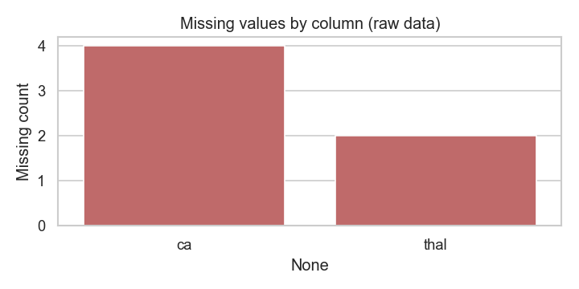 | 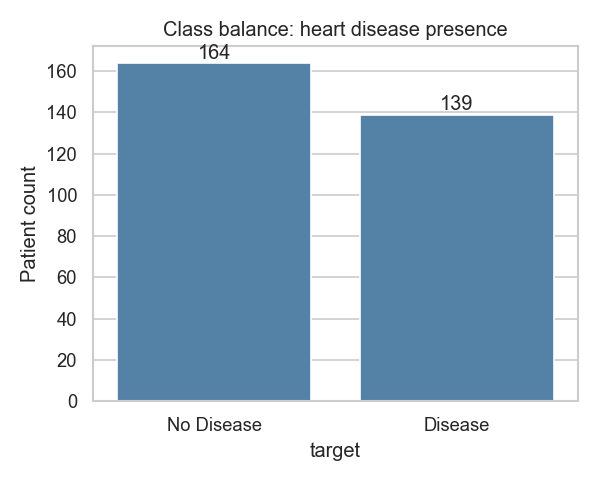 | 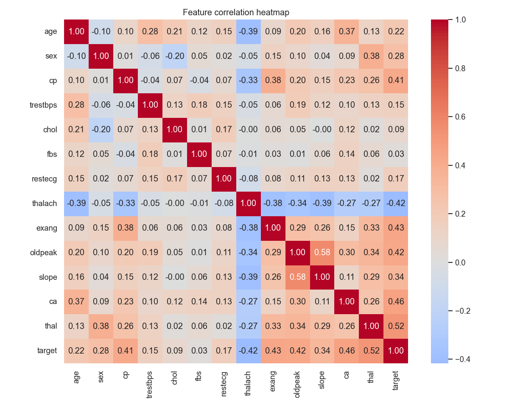 |

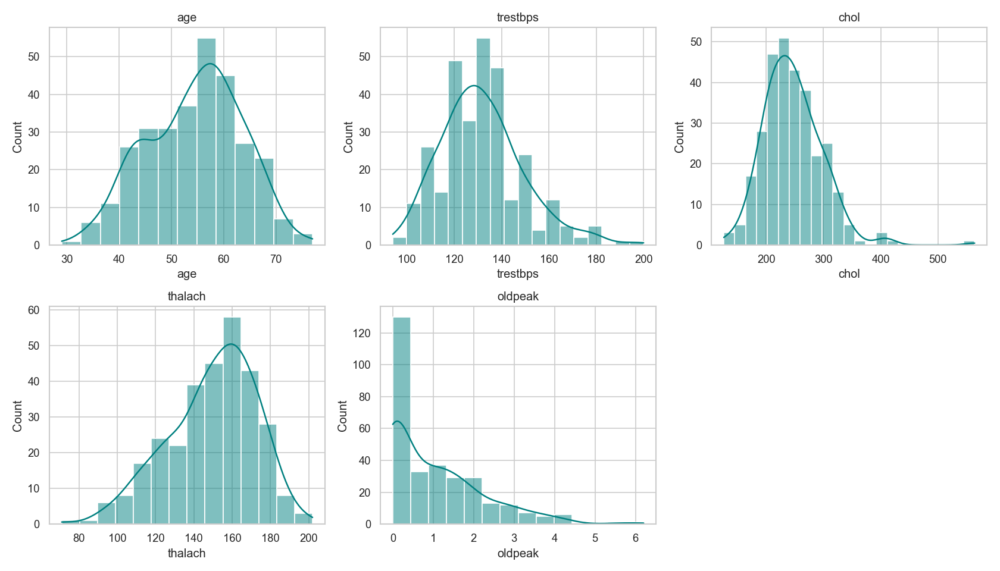

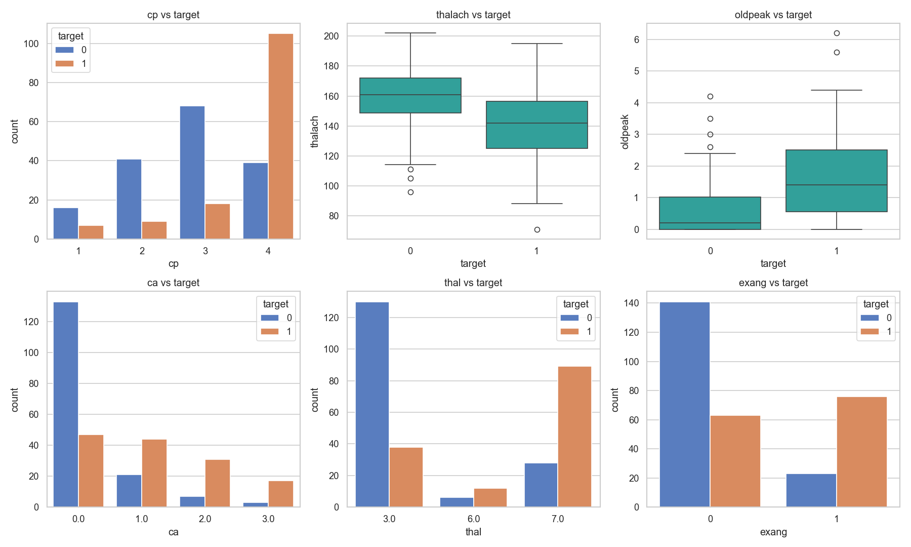

# 4. Feature Engineering & Model Development

Preprocessing (`src/pipeline.py`) uses a `ColumnTransformer` with three
feature groups:

- `StandardScaler` on continuous features: age, trestbps, chol, thalach,
  oldpeak, ca
- `OneHotEncoder(drop="first")` on multi-valued categorical features: cp,
  restecg, slope, thal
- sex, fbs, and exang pass through unchanged, as they are already binary

Three classifiers were trained and tuned with `GridSearchCV` over 5-fold
stratified cross-validation, optimizing for ROC-AUC:

| Model | Best hyperparameters | CV ROC-AUC | Test accuracy | Test precision | Test recall | Test F1 | Test ROC-AUC |
|---|---|---|---|---|---|---|---|
| Logistic Regression | C=1, solver=lbfgs | 0.909 | 0.852 | 0.806 | 0.893 | 0.847 | 0.957 |
| **Random Forest** (best) | max_depth=3, min_samples_leaf=4, n_estimators=200 | 0.897 | **0.918** | **0.897** | **0.929** | **0.912** | **0.973** |
| XGBoost | learning_rate=0.01, max_depth=3, n_estimators=100 | 0.878 | 0.869 | 0.885 | 0.821 | 0.852 | 0.936 |

Random Forest was selected as the final model, based on the highest test
ROC-AUC (0.973) and the best balance of precision and recall. Logistic
Regression scored marginally higher on cross-validated ROC-AUC alone (0.909
vs. 0.897), which illustrates that CV performance and held-out test
performance can diverge on a dataset of this size. Both figures are
reported rather than selecting the final model on CV score alone.

| Confusion matrices | ROC curves |
|---|---|
| 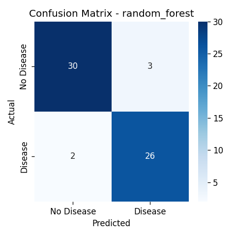 | 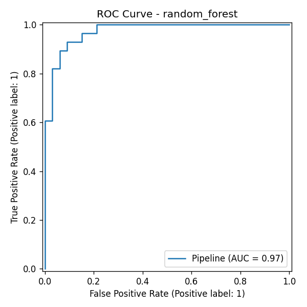 |
| 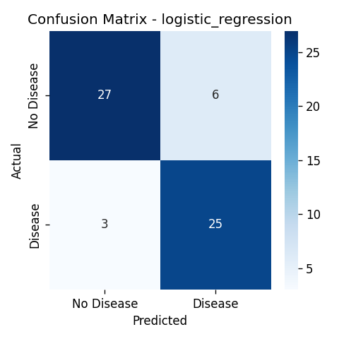 | 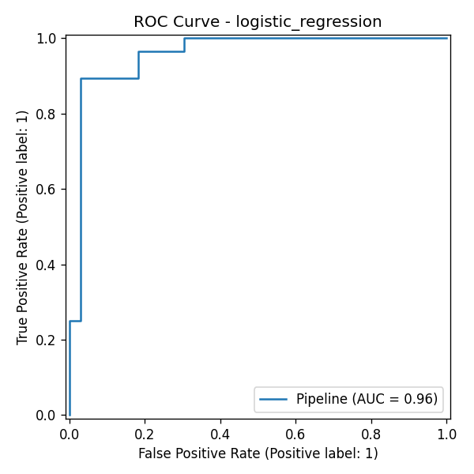 |
| 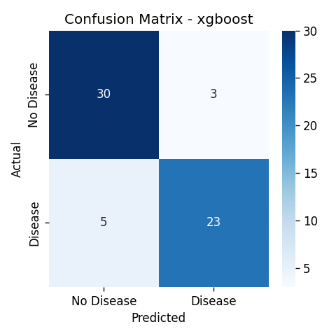 | 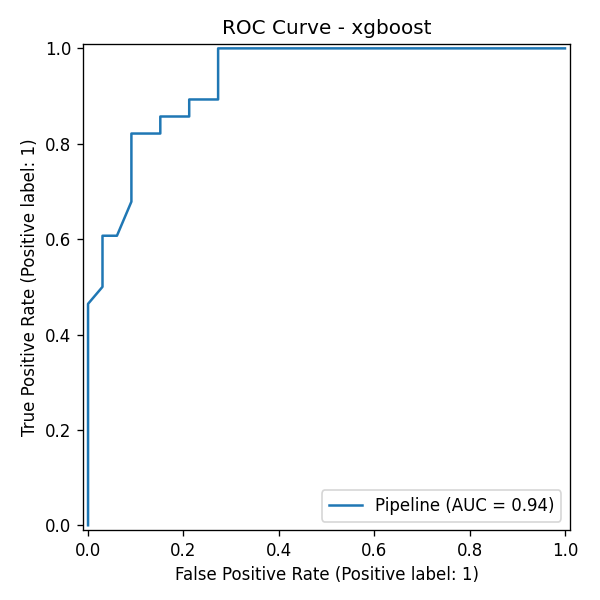 |

# 5. Experiment Tracking (MLflow)

Every training run is logged to MLflow under the
`heart-disease-classification` experiment (`src/train.py`):

- **Parameters:** the best hyperparameters selected by `GridSearchCV` for
  each model
- **Metrics:** CV ROC-AUC mean and standard deviation, plus test accuracy,
  precision, recall, F1, and ROC-AUC
- **Artifacts:** the confusion matrix plot, the ROC curve plot, and the
  serialized sklearn pipeline for that run

Runs can be browsed and compared with `mlflow ui` (http://127.0.0.1:5000).

# 6. Model Packaging & Reproducibility

The final pipeline — preprocessing and model combined into a single
`sklearn.Pipeline` object — is serialized with `joblib` to
`models/model.joblib`. Alongside it, `models/metadata.json` records the
selected model and the metrics for all three candidates. Bundling
preprocessing and model together ensures the API replays the exact
transformation used during training, without a separate, potentially
inconsistent implementation at inference time. Dependencies are pinned
in two files: `requirements.txt` for the full development and training
environment, and `requirements-api.txt` containing only what the Docker
image requires.

# 7. CI/CD Pipeline & Automated Testing

**Tests** (`tests/`, 13 total, Pytest) cover three areas: data cleaning
correctness (missing-value imputation, binary target conversion, row-count
consistency), preprocessing pipeline behavior (including handling of
categories not seen during training), and API behavior (valid and invalid
`/predict` requests, `/health`, `/metrics`).

**CI** (`.github/workflows/ci.yml`, GitHub Actions) runs: lint with flake8,
download the dataset, clean the data, run the unit tests, then train and
log to MLflow, uploading test results, the trained model, and MLflow run
artifacts. An ordering issue was identified during setup: the initial
workflow ran unit tests before downloading the dataset, which passed
locally only because the raw CSV was already present from earlier manual
runs, but failed on a fresh GitHub Actions runner with a
`FileNotFoundError`, since `data/raw/*.csv` is intentionally git-ignored.
Reordering the steps so data acquisition runs before the test step resolved
this, and the corrected pipeline was verified end-to-end on a clean runner.

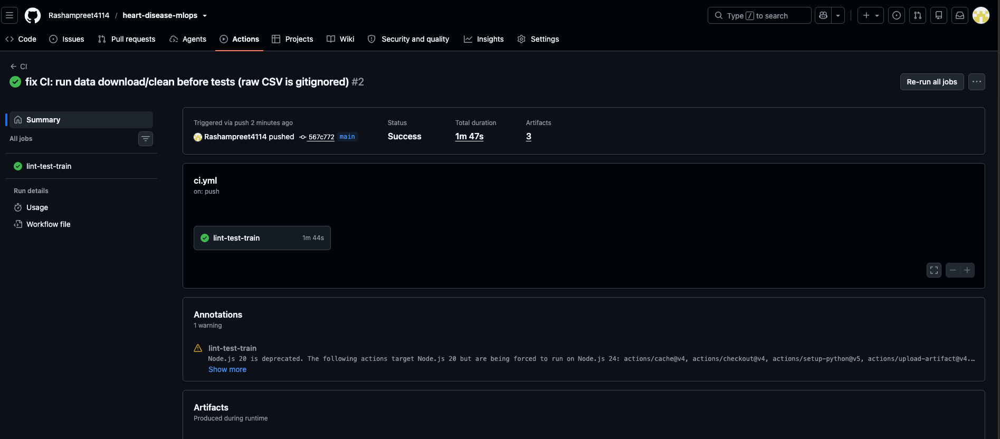

A self-contained, interactive HTML test report (13/13 passing) is included
at `screenshots/pytest_report.html` in the repository.

# 8. Model Containerization

The FastAPI service (`api/main.py`) exposes:

- `POST /predict` — accepts patient features as JSON, returns a prediction,
  label, and confidence score
- `GET /health` — liveness/readiness check
- `GET /metrics` — request and prediction counters as JSON
- `GET /dashboard` — an HTML view of the same counters
- `GET /docs` — auto-generated Swagger UI

The `Dockerfile` builds on `python:3.11-slim` and installs only
`requirements-api.txt`, keeping the image free of training-only
dependencies such as Jupyter and MLflow. The image was built and run
locally to confirm correct operation:

```bash
docker build -t heart-disease-api:latest .
docker run -d --name heart-disease-api -p 8000:8000 heart-disease-api:latest
curl -X POST http://localhost:8000/predict -H "Content-Type: application/json" -d '{...}'
# -> {"prediction": 0, "label": "No Disease", "confidence": 0.6509}
```

This result matched the prediction obtained from the same request run
directly (without Docker) and later through the Kubernetes deployment,
confirming consistent behavior across environments.

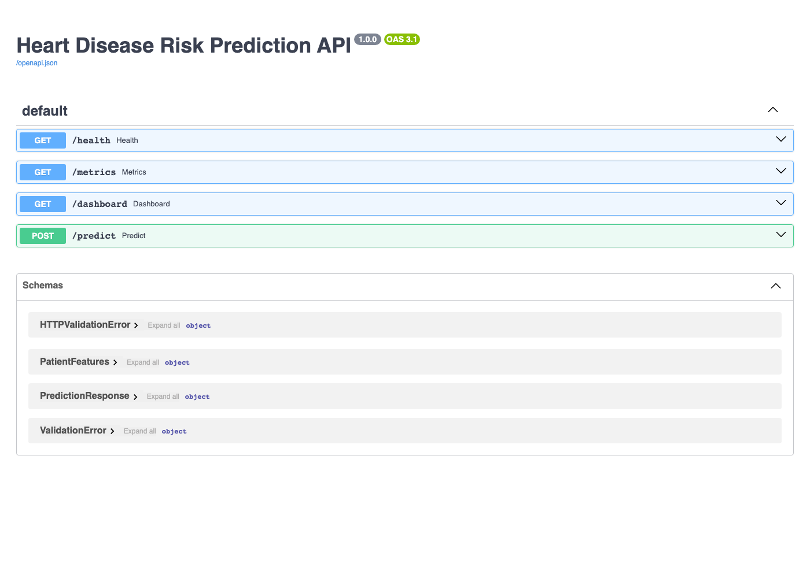

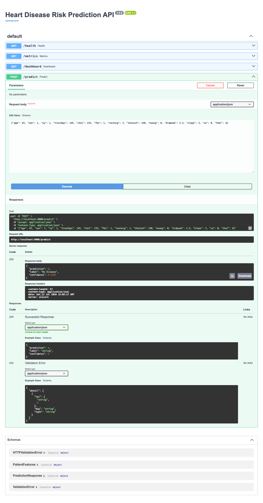

# 9. Production Deployment

The API is deployed to Docker Desktop's built-in Kubernetes cluster
(`k8s/deployment.yaml`, `k8s/service.yaml`): 2 replicas behind a
`LoadBalancer` Service, with readiness and liveness probes against
`/health`.

```bash
kubectl apply -f k8s/deployment.yaml -f k8s/service.yaml
kubectl get pods,svc
```

On Docker Desktop's local cluster, the `EXTERNAL-IP` assigned to the
Service is not routable from the host, since there is no cloud load
balancer backing it. Verification was therefore performed using
`kubectl port-forward svc/heart-disease-api-service 8080:80`, which is
also documented in the README as the access path for local grading. On a
managed cloud cluster (EKS, GKE, or AKS), the external IP would be
reachable directly.

```
NAME                                READY   STATUS    RESTARTS   AGE
pod/heart-disease-api-b9ccfc57f-k8zjz   1/1   Running   0   110s
pod/heart-disease-api-b9ccfc57f-t6x4g   1/1   Running   0   110s

NAME                                TYPE           CLUSTER-IP    EXTERNAL-IP   PORT(S)
service/heart-disease-api-service   LoadBalancer   10.96.14.53   172.18.0.5    80:31363/TCP
```

Both `/health` and `/predict` responded correctly through the Service,
confirming that Kubernetes was load-balancing requests across both pods
rather than routing to a single instance.

# 10. Monitoring & Logging

Each request is logged — method, path, status code, latency — to both
`logs/api.log` and stdout, using Python's standard `logging` module.
In-memory counters (total requests, counts by status code, total
predictions, counts by predicted class) are exposed at `/metrics` as JSON
and rendered as a table at `/dashboard`. This covers the core signals —
traffic volume, error rate, and prediction distribution — that would feed
into a Prometheus/Grafana setup at larger scale, at a level of effort
consistent with this component's weight in the grading rubric.

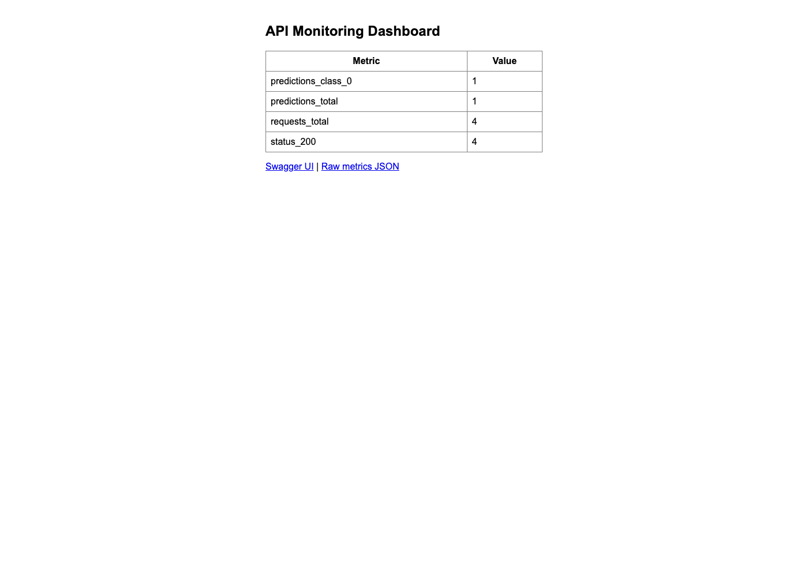

# 11. Conclusion

The pipeline addresses all nine assignment components: reproducible data
acquisition and EDA, a tuned three-model comparison with cross-validation,
MLflow tracking for every run, a packaged and reusable inference pipeline,
a CI/CD pipeline that fails on error (and did so once during development,
correctly surfacing a data-ordering bug), a containerized API verified
with sample input, a Kubernetes deployment with a load-balanced Service,
and request-level monitoring. Each component was verified in the
environment it is intended to run in — locally, inside Docker, on the
Kubernetes deployment, and on a clean GitHub Actions runner — before being
considered complete.
